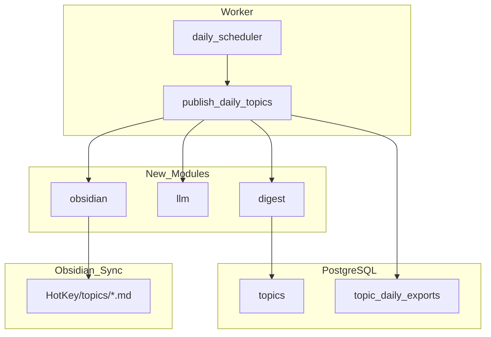

## Goals

- 为 hotkey-server 引入日报沉淀层，将热点主题按 CST 自然日写入 Obsidian 知识库
- 通过 `topic_daily_exports` 保证幂等、可重试、可审计
- LLM 仅用于摘要生成，不改变聚类逻辑

## Non-Goals

- 不修改 `internal/topic.Cluster()` 聚类算法
- 不引入 Web 配置页或多用户 Vault 路径
- 不变更 OpenAPI 契约

## Architecture



## Module Responsibilities

| Package | Responsibility |
|---------|---------------|
| `internal/digest` | CST 自然日窗口、主题入选规则、代表帖聚合 |
| `internal/llm` | `SummarizeTopic` 接口、OpenAI 兼容实现、prompt 模板 |
| `internal/obsidian` | frontmatter 渲染、slug 生成、原子写文件 |
| `internal/jobs/publish_daily_topics.go` | 编排：monitors → digest → LLM → export → write |
| `internal/jobs/daily_scheduler.go` | 每分钟 gate，判断是否到达 `DAILY_DIGEST_TIME` |
| `internal/database/digestrepo.go` | `topic_daily_exports` CRUD |

## Data Model

### topic_daily_exports

```sql
CREATE TABLE topic_daily_exports (
  id BIGSERIAL PRIMARY KEY,
  monitor_id BIGINT NOT NULL REFERENCES keyword_monitors(id),
  topic_id BIGINT NOT NULL REFERENCES topics(id),
  export_date DATE NOT NULL,
  summary_text TEXT NOT NULL DEFAULT '',
  markdown_path TEXT NOT NULL DEFAULT '',
  status TEXT NOT NULL DEFAULT 'pending',
  error_message TEXT NOT NULL DEFAULT '',
  published_at TIMESTAMPTZ,
  created_at TIMESTAMPTZ NOT NULL DEFAULT now(),
  UNIQUE(monitor_id, topic_id, export_date)
);
```

- `status`: `pending` | `published` | `failed`
- 幂等键：`(monitor_id, topic_id, export_date)`

### DigestRepo Interface

```go
type DigestRepo interface {
    UpsertExport(ctx context.Context, arg UpsertExportParams) (TopicDailyExport, error)
    GetByTopicDate(ctx context.Context, topicID int64, exportDate time.Time) (TopicDailyExport, error)
    UpdateStatus(ctx context.Context, id int64, status string, errMsg string) error
    ListPendingByDate(ctx context.Context, exportDate time.Time) ([]TopicDailyExport, error)
}
```

## Configuration

| Env Var | Default | Description |
|---------|---------|-------------|
| `OBSIDIAN_VAULT_PATH` | — | Vault root (required) |
| `DAILY_DIGEST_TIME` | `08:00` | CST trigger time |
| `DAILY_DIGEST_TIMEZONE` | `Asia/Shanghai` | Timezone |
| `DAILY_DIGEST_TARGET` | `yesterday` | `yesterday` \| `today` |
| `DAILY_DIGEST_TOP_N` | `20` | Max topics per monitor |
| `LLM_PROVIDER` | `openai` | LLM provider |
| `LLM_API_KEY` | — | API Key (required when LLM enabled) |
| `LLM_BASE_URL` | `https://api.openai.com/v1` | Compatible gateway |
| `LLM_MODEL` | `gpt-4o-mini` | Model |

## LLM Design

```go
type Client interface {
    SummarizeTopic(ctx context.Context, in TopicSummaryInput) (string, error)
}

type TopicSummaryInput struct {
    MonitorName string
    TopicTitle  string
    TopicKey    string
    HeatScore   float64
    Trend       string
    PostCount   int
    Posts       []PostExcerpt
}

type PostExcerpt struct {
    Author   string
    Text     string // max 500 chars
    PostURL  string
}
```

- Input: monitor name, topic title, representative posts, heat/trend/post_count
- Truncation: max 500 chars per post
- Output: objective Chinese summary, 2-4 paragraphs
- Failure: `status=failed`, no file written

## Scheduling

- Register `publish_daily_topics` with `jobs.Runner` at 1min interval
- `daily_scheduler` gate: `current CST time >= DAILY_DIGEST_TIME` AND today's batch not yet executed
- Idempotency: query `topic_daily_exports` or use advisory lock

## Error Handling

| Scenario | Behavior |
|----------|----------|
| Vault no write permission | exports `failed`, log error |
| LLM timeout/rate limit | single topic `failed`, others continue |
| Sync conflict | `*.md.tmp` → `rename` atomic write |
| No active topics | skip, no empty file |

## Rollback

- Drop `topic_daily_exports` table
- Remove `internal/digest`, `internal/llm`, `internal/obsidian`
- Remove `internal/jobs/daily_scheduler.go`, `internal/jobs/publish_daily_topics.go`
- Remove config fields from `internal/config/config.go`
- `go mod tidy`
