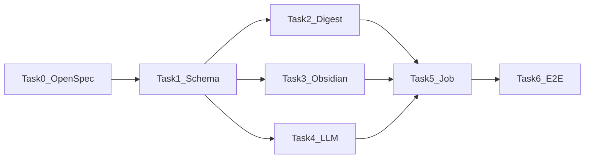

## Tasks

### T1: 数据模型与配置（STE-303）

- [ ] T1.1 创建 `topic_daily_exports` 表迁移 DDL
- [ ] T1.2 扩展 `internal/config/config.go`，新增 9 个日报相关配置字段
- [ ] T1.3 写 config 默认值测试（`TestLoad_DailyDigestConfigDefaults`）
- [ ] T1.4 实现 `internal/database/digestrepo.go`（UpsertExport、GetByTopicDate、UpdateStatus）
- [ ] T1.5 写 digestrepo 单元测试

**Validation:** `go test ./internal/config ./internal/database -run Digest -v`

---

### T2: digest 模块 — 自然日窗口与主题筛选（STE-304）

- [ ] T2.1 写 `DayWindow(now, timezone)` CST 边界测试
- [ ] T2.2 实现 `internal/digest/window.go`（DayWindow、ResolveExportDate）
- [ ] T2.3 写主题入选测试 — mock repo 返回 hits/posts，验证 Top N 与活跃过滤
- [ ] T2.4 实现 `internal/digest/selector.go`（ListTopicsForDay — JOIN topics, topic_posts, monitor_post_hits, platform_posts）
- [ ] T2.5 实现 `FetchRepresentativePosts(topicID, limit=3)`
- [ ] T2.6 实现 `internal/digest/service.go`（Service 聚合）

**Validation:** `go test ./internal/digest -v`

---

### T3: obsidian 模块 — Markdown 渲染与原子写盘（STE-305）

- [ ] T3.1 写 slug 安全测试（`TestSlugify_RemovesSpecialChars`）
- [ ] T3.2 实现 `internal/obsidian/slug.go`（Slugify）
- [ ] T3.3 写 frontmatter 渲染测试 — 断言 `type`, `date`, `monitor_id`, `tags` 存在
- [ ] T3.4 实现 `internal/obsidian/render.go`（RenderTopicNote、BuildPath）
- [ ] T3.5 写原子写盘测试 — temp dir，WriteAtomic 后无 .tmp 残留
- [ ] T3.6 实现 `internal/obsidian/writer.go`（WriteAtomic — write .tmp → rename）

**Validation:** `go test ./internal/obsidian -v`

---

### T4: LLM 摘要模块（STE-306）

- [ ] T4.1 定义 `internal/llm/client.go`（Client 接口、TopicSummaryInput、PostExcerpt）
- [ ] T4.2 写 mock client 测试 — 返回固定摘要，验证 prompt 输入截断
- [ ] T4.3 实现 `internal/llm/mock.go`（MockClient）与 `internal/llm/prompt.go`（PromptBuilder）
- [ ] T4.4 实现 `internal/llm/openai.go`（OpenAI 兼容 HTTP client — POST /chat/completions）
- [ ] T4.5 写 httptest 覆盖 — mock 200 response

**Validation:** `go test ./internal/llm -v`

---

### T5: 发布 Job 与调度（STE-307）

- [ ] T5.1 写 scheduler gate 测试 — 08:00 前不触发；08:00 后触发一次；同日不重复
- [ ] T5.2 实现 `internal/jobs/daily_scheduler.go`（DailyScheduler.ShouldRun）
- [ ] T5.3 写 publish job 集成测试 — fake digest/llm/repo + temp vault dir
- [ ] T5.4 实现 `internal/jobs/publish_daily_topics.go`（PublishDailyTopicsJob.Run）
- [ ] T5.5 注册到 `internal/app/worker_jobs.go` — interval 1min，内部 scheduler gate

**Validation:** `go test ./internal/jobs -run 'Daily|Publish' -v`

---

### T6: 端到端测试与文档验收（STE-308）

- [ ] T6.1 写幂等测试 — 同 topic+date 执行两次，文件数不变、内容更新
- [ ] T6.2 写 LLM 失败隔离测试 — 一个 topic 失败，其他仍 published
- [ ] T6.3 写 Vault 权限失败测试 — exports status=failed
- [ ] T6.4 全量验证：`make test && make lint && make validate`
- [ ] T6.5 手工验收清单：配置 Vault 路径 → 触发 job → Obsidian Dataview 查询 → frontmatter 可筛选

**Validation:** `make test && make lint && make validate`

---

## Task Dependency

## Linear Issue Mapping

| Task | Issue | Title |
|------|-------|-------|
| Epic | STE-301 | 热点日报 Obsidian 知识库 MVP |
| Task 0 | STE-302 | OpenSpec + 设计文档门禁 |
| Task 1 | STE-303 | topic_daily_exports 与配置扩展 |
| Task 2 | STE-304 | digest 自然日窗口与主题筛选 |
| Task 3 | STE-305 | obsidian Markdown 渲染与写盘 |
| Task 4 | STE-306 | LLM 摘要模块 |
| Task 5 | STE-307 | publish_daily_topics Job + 调度 |
| Task 6 | STE-308 | 端到端测试与验收 |
